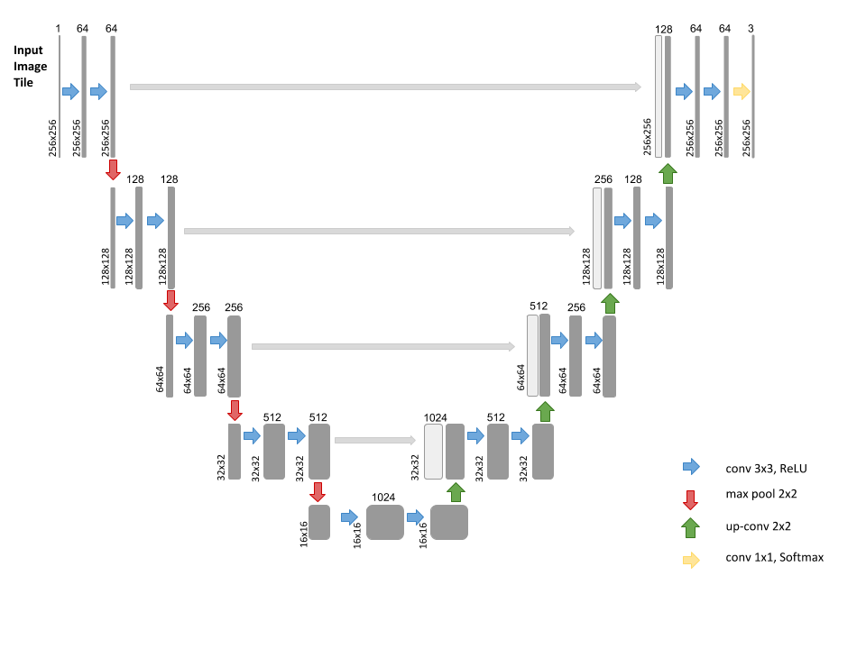

# Modified Multi Class U-NET with Keras for Semantic Segmentation of Aortic Dissection Images  

U-Net: Convolutional Networks for Biomedical Image Segmentation](http://lmb.informatik.uni-freiburg.de/people/ronneber/u-net/).

Code inspired by: https://github.com/zhixuhao/unet

---

## Overview

A 2D U-net as well as 3D U-net implementation for segmentation of aorta images.

Input to 2D is of form: (256x256x1)

Ground truth:           (256x256x3) 

Input to 3D is of form (4x256x256x1)

Ground truth:          (4x256x256x3)

### Data

Input is 256x256 grayscale images.

### Data augmentation

None

### Model

This deep neural network is implemented with Keras functional API.

Output from the network is a 256x256x3.

### Loss functions

Dice_Coef_Loss = 1 - Dice Score

Categorical_Crossentropy_Loss

Combined_Loss = w0(Categorical_Crossentropy_Loss)+ w1(Dice_Coef_Loss)

### Results

Dice Score used for metric.

|    Model   | DC Train  (%)| DC Test   (%)| DC Test   (%)|
|:----------:|:------------:|:------------:|:------------:|
|   2D U-net |     93       |      89      |      72      |
|   3D U-net |     92       |      88      |      80      |

---

## How to use

### Dependencies

This tutorial depends on the following libraries:

* Tensorflow
* Keras >= 1.0
* Python versions 2.7-3.5

For 2D Follow notebook train_2D
For 3D Follow notebook train_3D

You will see the predicted results of test image in data/test_results

### 

## About Keras

Keras is a minimalist, highly modular neural networks library, written in Python and capable of running on top of either TensorFlow or Theano. It was developed with a focus on enabling fast experimentation. Being able to go from idea to result with the least possible delay is key to doing good research.

Use Keras if you need a deep learning library that:

allows for easy and fast prototyping (through total modularity, minimalism, and extensibility).
supports both convolutional networks and recurrent networks, as well as combinations of the two.
supports arbitrary connectivity schemes (including multi-input and multi-output training).
runs seamlessly on CPU and GPU.
Read the documentation [Keras.io](http://keras.io/)

Keras is compatible with: Python 2.7-3.5.
